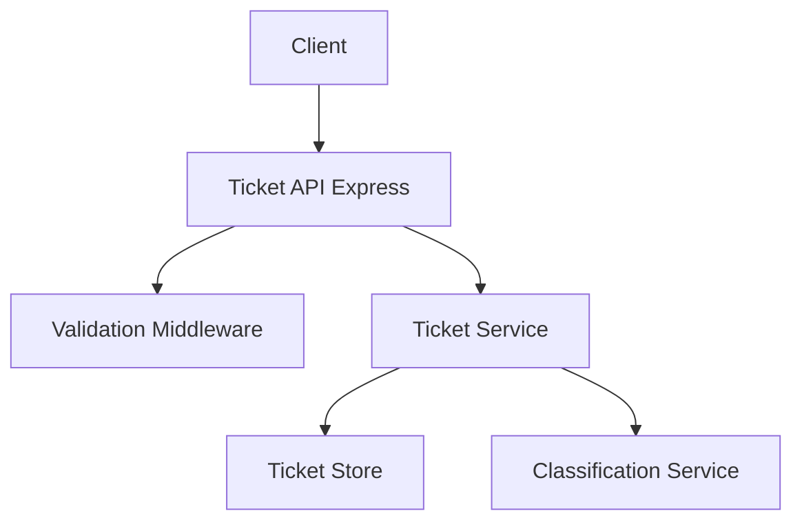

# 🚀 Merge Request: Homework 2 - Intelligent Customer Support Ticket System

## 📋 Overview
Complete Node.js/Express REST API for customer support tickets with multi-format bulk import (CSV/JSON/XML), keyword-based auto-classification, and comprehensive test suite. Built entirely with Gemini CLI using the Context-Model-Prompt framework and Subagent-Driven Development.

## 🎯 Learning Objectives Coverage
- [x] Master the **Context-Model-Prompt framework** in practice.
- [x] Generate comprehensive test suites with AI (>90% coverage).
- [x] Create multi-level documentation.

## 🚀 What Was Built
**API Features:**
*   **Endpoints:** 7 REST endpoints (POST/GET/PUT/DELETE, bulk import, auto-classify).
*   **Import:** Multi-format parser with auto-detection (CSV parsing, JSON, XML via `xml2js`) with detailed bulk error reporting.
*   **Classification Engine:** Mock LLM service using keyword-based analysis (6 categories, 4 priorities, confidence scoring).
*   **Validation:** Centralized validation middleware for request data integrity, with full unit test coverage.
*   **Store:** In-memory `Map`-like store with UUID-keyed O(1) lookups and duplicate detection (Email + Subject).

**Tech Stack:** Node.js, Express, TypeScript, UUID, Vitest, csv-parse, xml2js, Supertest.

## 🤖 How AI Was Used
Development executed via Gemini CLI using **Subagent-Driven Development**:
*   **Planning Phase:** Analyzed `TASKS.md`, defined layered architecture (Routes → Services → Repositories + Middleware).
*   **Implementation Phase:**
    *   Executed task-specific subagent delegations for service logic, models, and validation middleware.
    *   Strictly followed project conventions (Named Exports, no default exports).
    *   TDD-based approach ensuring branch-level coverage > 90%.
*   **Documentation Phase:** 
    *   Generated multi-level documentation (Architecture, API Reference, Testing Guide) with integrated Mermaid diagrams.

## 📚 Documentation
- [API Reference](docs/API_REFERENCE.md)
- [Architecture Guide](docs/ARCHITECTURE.md)
- [Testing Guide](docs/TESTING_GUIDE.md)
- [Project Structure](docs/project-structure.txt)

## 🎮 Quick Demo
```bash
# Install & start
npm install
npm start

# Create a ticket (201)
curl -X POST http://localhost:3000/tickets 
  -H "Content-Type: application/json" 
  -d '{"customer_email":"user@test.com", "subject":"Access", "description":"Can not login"}'

# List tickets
curl http://localhost:3000/tickets

# Bulk import
curl -X POST http://localhost:3000/tickets/import 
  -H "Content-Type: application/json" 
  -d '[{"customer_email":"a@b.com", "subject":"S", "description":"D"}]'

# Auto-classify
curl -X POST http://localhost:3000/tickets/<UUID>/auto-classify
```
*Full API details: `docs/API_REFERENCE.md`*

## ✅ Verify the Work
```bash
# Run all tests + coverage report
npm run test:coverage
```
*Status: All 78 tests pass, final coverage >90%.*

## 🏗️ Architecture Diagram


## 📸 Verification Screenshots
Below are screenshots documenting the verification process:

- **Verification Script Execution:**
  
  
- **Test Coverage Report:**
  


## 📦 Deliverables
✅ Source code (TypeScript, modular structure)
✅ Test suite (10 test files, ~90.5% coverage)
✅ Documentation (4 guides with Mermaid diagrams)
✅ Sample Data
✅ Implementation Plan

## 🛠️ Fixes Applied (TypeScript Compilation)
This Pull Request resolves several TypeScript compilation errors that prevented the application from building and running successfully.

- **Type Definitions**: Added `@types/multer` and `@types/express` to `devDependencies` to resolve missing declaration file errors for `multer` and allow proper access to `req.file` in `ticketRoutes.ts`.
- **Service Layer Alignment**: 
  - Updated `TicketService` methods to align with the `ClassificationService` signature (2 arguments instead of 3).
  - Added `await` to `classificationService.classify` calls to correctly handle the returned Promise.
- **Error Handling**: Updated `src/parsers/jsonParser.ts` to correctly handle `unknown` error types in the `catch` block, ensuring safe access to the error message.

## 🧪 Automated Endpoint Verification Scripts
To simplify comprehensive testing of all API endpoints, automated scripts have been added to `homework-2/demo/`. These scripts start the server, execute a series of `curl` commands with logging, and stop the server upon completion.

### How to run:
- **macOS / Linux:**
  ```bash
  cd demo
  chmod +x run_verification.sh
  ./run_verification.sh
  ```
- **Windows:**
  ```cmd
  cd demo
  run_verification.bat
  ```

*Note: These scripts require `curl` and `npm` installed in your path. The macOS/Linux script also requires `jq` for formatted JSON output.*

### Verification Results:
```text
=== Starting Verification Suite ===

[Command] Create Ticket
[Parameters] POST http://localhost:3000/tickets
... (Ticket successfully created)

[Command] List Tickets
[Parameters] GET http://localhost:3000/tickets
... (Ticket listed)

[Command] Get Specific Ticket
[Parameters] GET http://localhost:3000/tickets/dfc83988-450b-473b-99c2-0d9c8b02ed2a
... (Ticket retrieved)

[Command] Auto-classify Ticket
[Parameters] POST http://localhost:3000/tickets/dfc83988-450b-473b-99c2-0d9c8b02ed2a/auto-classify
{
  "category": "account_access",
  "priority": "medium",
  "confidence": 0.4,
  "reasoning": "Classification based on keyword matching.",
  "keywords_found": ["login", "account"]
}

[Command] Update Ticket
[Parameters] PUT http://localhost:3000/tickets/dfc83988-450b-473b-99c2-0d9c8b02ed2a
... (Ticket updated successfully)

[Command] Delete Ticket
[Parameters] DELETE http://localhost:3000/tickets/dfc83988-450b-473b-99c2-0d9c8b02ed2a
HTTP/1.1 204 No Content

[Command] Bulk Import (JSON)
[Parameters] POST http://localhost:3000/tickets/import
... (Bulk import handled)

=== Verification Complete ===
```

