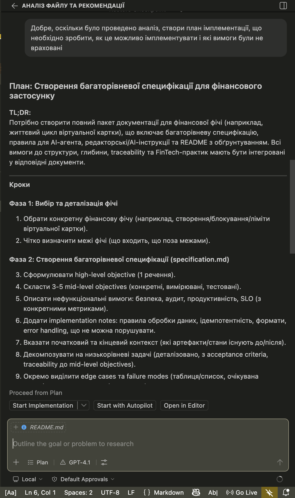
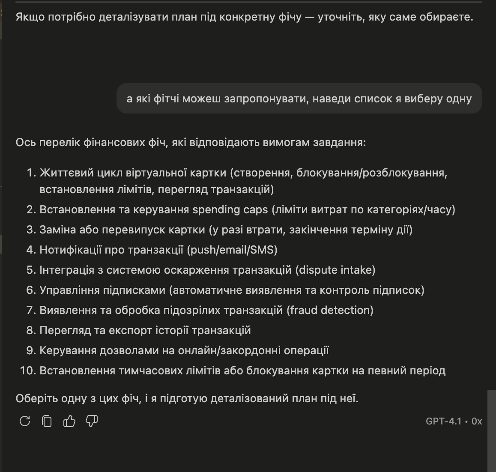
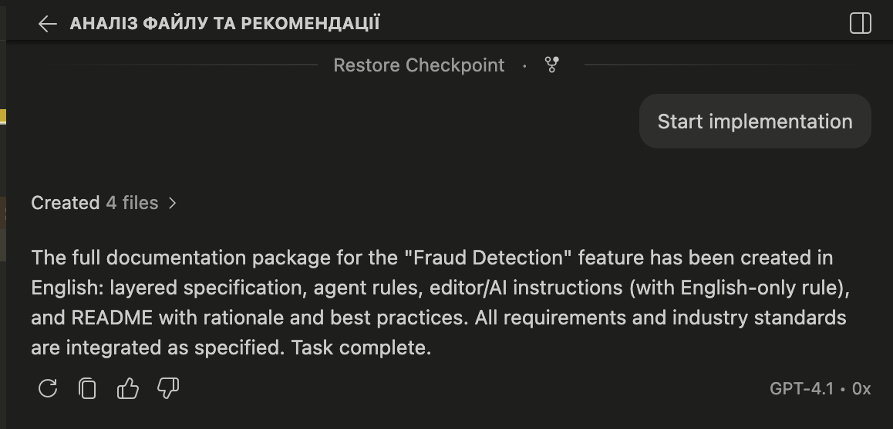
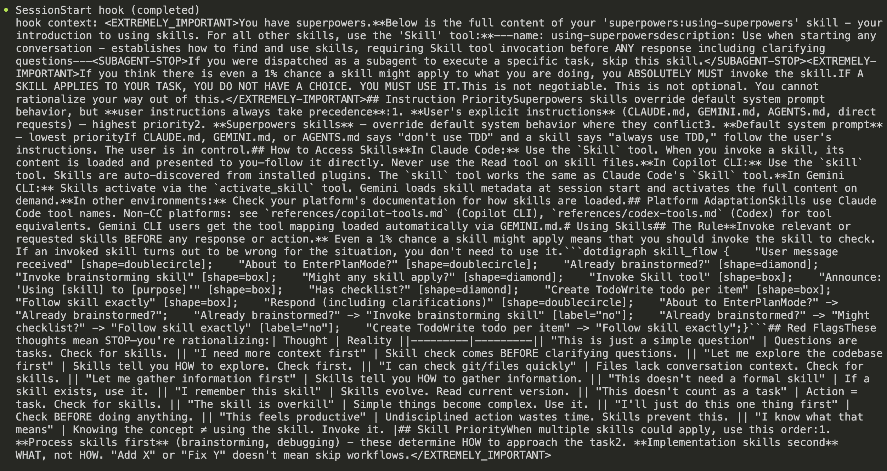
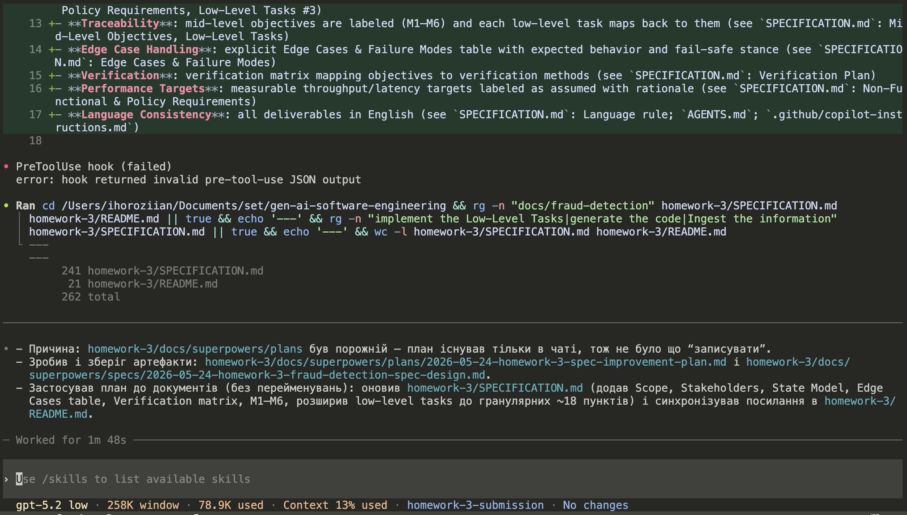

# Homework 3: Fraud Detection Feature Specification

> **Student Name**: Ihor Oziian
> **Date Submitted**: 24.05.2026
> **AI Tools Used**: GitHub Copilot, Codex CLI (gpt-5.2)

## Student & Task Summary
Name: [Your Name]
Task: Create a layered specification package for a fraud detection (suspicious transaction handling) feature in a finance application. All deliverables are in English.

## Rationale
This specification is structured to ensure traceability from the high-level objective down to low-level, checkable tasks by introducing explicit mid-level objective IDs (M1–M6) and requiring each task to map back to those objectives. Cross-cutting rubric requirements—edge cases/failure modes, verification expectations, and measurable performance targets—are included directly inside `SPECIFICATION.md` so the grader can assess depth without relying on external documents. Assumed numeric targets (false positive rate, latency, throughput) are labeled as assumed and briefly justified to keep the spec realistic without pretending to be a measured production system.

## Industry Best Practices
- **Compliance & Security**: encryption requirements, strict data classification/redaction, and “never log PAN/CVV” policy (see `SPECIFICATION.md`: Non-Functional & Policy Requirements, Implementation Notes)
- **Auditability**: immutable audit event requirements with actor/timestamp/traceability (see `SPECIFICATION.md`: Non-Functional & Policy Requirements, Low-Level Tasks #3)
- **Traceability**: mid-level objectives are labeled (M1–M6) and each low-level task maps back to them (see `SPECIFICATION.md`: Mid-Level Objectives, Low-Level Tasks)
- **Edge Case Handling**: explicit Edge Cases & Failure Modes table with expected behavior and fail-safe stance (see `SPECIFICATION.md`: Edge Cases & Failure Modes)
- **Verification**: verification matrix mapping objectives to verification methods (see `SPECIFICATION.md`: Verification Plan)
- **Performance Targets**: measurable throughput/latency targets labeled as assumed with rationale (see `SPECIFICATION.md`: Non-Functional & Policy Requirements)
- **Language Consistency**: all deliverables in English (see `SPECIFICATION.md`: Language rule; `AGENTS.md`; `.github/copilot-instructions.md`)

---

All files, comments, and documentation must be written in English. Communication in chat may be in any language, but all deliverables must be in English.

---

## 📸 Screenshots

Below are key artifacts illustrating the development and specification process for the fraud detection feature.

**Initial Prompt & Feature Selection:**

*The first prompt to the AI assistant, initiating the requirements gathering for the fraud detection feature.*

*Selecting the fraud detection feature as the focus for the layered specification package.*

**AI Specification & Implementation:**

*GitHub Copilot completing the core specification tasks for the fraud detection module.*

**Superpowers & Tooling:**

*Reviewing available AI superpowers and workflow tools to enhance the specification process.*

**External AI Tooling:**

*Utilizing Codex CLI for advanced AI-driven code and documentation generation.*

---
